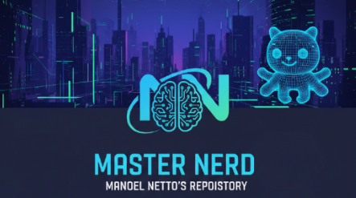

# Master Nerd

[](LICENSE)
[](https://github.com/eusoumanoelnetto/master_nerd)
[](https://www.electronjs.org/)
[](https://nodejs.org/)

Aplicação desktop com estética retrô arcade. Uma experiência nostálgica de computação dos anos 80/90.

## Características

- **Interface Retrô**: Design autêntico em estilo arcade com efeitos CRT e neon
- **Construído em Electron**: Aplicação desktop multiplataforma
- **Temas Customizados**: Efeitos visuais imersivos e animações fluidas
- **Portável**: Executável standalone sem dependências externas
- **Código Open Source**: Código completo e documentado

## Como Usar

### Usuários finais

1. **Download da versão executável**
   - Acesse os [Releases no GitHub](https://github.com/eusoumanoelnetto/master_nerd/releases)
   - Baixe `Master Nerd.exe` (versão portátil)
   - Execute diretamente (não requer instalação)

2. **Configuração rápida**
   - Não requer instalação adicional
   - Compatível com Windows 10+ (64-bit)
   - Todas as dependências incluídas no executável

### Desenvolvedores

#### Pré-requisitos

Desenvolvido para entusiastas de tecnologia retrô.
        bootable_pendrive.ps1
        format_pendrive.ps1
        mas_activation.ps1
 src/
    powershell/
        MasterNerd.Bootstrap.ps1
        usb-toolkit/
            Format-UsbDrive.ps1
 docs/                    # GitHub Pages landing page
     index.html
     style.css
     script.js
\\\

## Stack de Tecnologias

| Tecnologia | Versão | Propósito |
|-----------|--------|----------|
| Electron | ^27.0.0 | Framework desktop |
| Node.js | 18+ | Runtime JavaScript |
| electron-builder | ^24.6.4 | Build e packaging |
| HTML5 | - | Interface |
| CSS3 | - | Estilos e animações |
| JavaScript | ES6+ | Lógica da aplicação |

## Recursos Visuais

- **Efeitos CRT**: Reproduz a aparência autêntica de monitores de tubo de raios catódicos
- **Neon Glow**: Efeitos de iluminação neon nos elementos da interface
- **Glitch Effects**: Animações de distorção retrô
- **Scanlines**: Linhas de varredura típicas de displays antigos
- **Star Field**: Campo de estrelas em paralaxe como screensaver

## Requisitos do Sistema

- **SO**: Windows 7 ou superior / macOS 10.11+ / Linux (AppImage)
- **Processador**: Pentium IV 2.0 GHz ou superior
- **RAM**: 512 MB mínimo (1 GB recomendado)
- **Espaço em Disco**: 150 MB disponível
- **Resolução**: 1024x768 ou superior

## Configuração para Desenvolvimento

### Setup Visual Studio Code

1. Instale as extensões recomendadas:
   - ESLint
   - Prettier
   - Electron DevTools

2. Configure o lançador (`.vscode/launch.json`):

```json
{
   "version": "0.2.0",
   "configurations": [
      {
         "name": "Electron",
         "type": "node",
         "request": "launch",
         "program": "${workspaceFolder}/master/main.js",
         "restart": true,
         "console": "integratedTerminal"
      }
   ]
}
```

### Comandos Úteis

```bash
# Desenvolvimento com hot reload
npm start

# Build executável Windows
npm run build

# Build portátil
npm run build -- --win portable

# Build installer
npm run build -- --win nsis

# Lint do código
npm run lint

# Testes
npm test
```

## Troubleshooting

### Aplicação não inicia

- Verifique se Node.js está instalado: `node --version`
- Reinstale dependências: `rm -r node_modules && npm install`
- Verifique portas em uso: a aplicação pode usar porta 3000

### Problemas de compatibilidade

- Atualize para a versão mais recente do Electron
- Verifique se você atende aos requisitos mínimos do sistema
- Tente desabilitar aceleração de hardware: `--no-gpu`

### Build falhando

- Limpe cache: `npm cache clean --force`
- Remova node_modules: `rm -r node_modules`
- Reinstale tudo: `npm install && npm run build`

## Licença

Este projeto está licenciado sob a MIT License. Veja [LICENSE](LICENSE) para mais detalhes.

## Contribuindo

Contribuições são bem-vindas! Por favor:

1. Faça um Fork do projeto
2. Crie uma branch para sua feature (`git checkout -b feature/AmazingFeature`)
3. Commit suas mudanças (`git commit -m 'Add some AmazingFeature'`)
4. Push para a branch (`git push origin feature/AmazingFeature`)
5. Abra um Pull Request

## Contato & Suporte

- **Issues**: [GitHub Issues](https://github.com/master-nerd/master-nerd/issues)
- **Discussões**: [GitHub Discussions](https://github.com/master-nerd/master-nerd/discussions)

## Agradecimentos

- Comunidade Electron
- Inspiração em interfaces retrô clássicas
- Todos os contribuidores

---

Desenvolvido com ❤️ e ☕ por [Manoel Coelho](https://linkedin.com/in/eusoumanoelnetto) para entusiastas de tecnologia retrô
